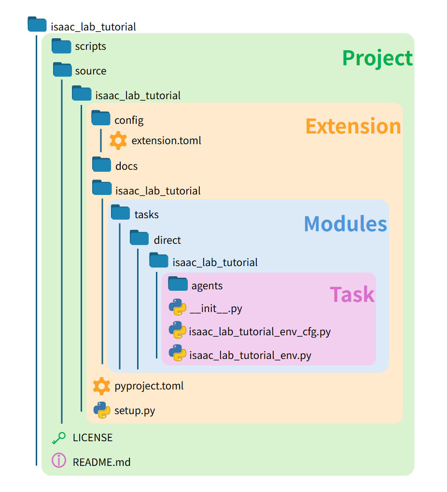
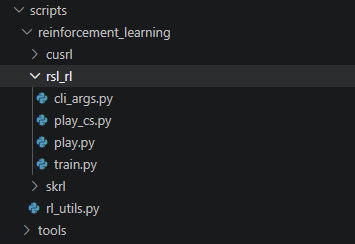
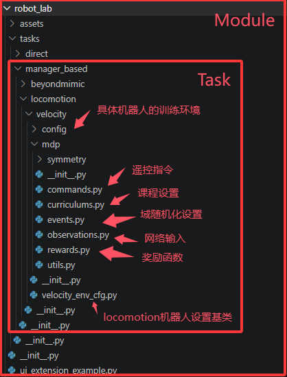
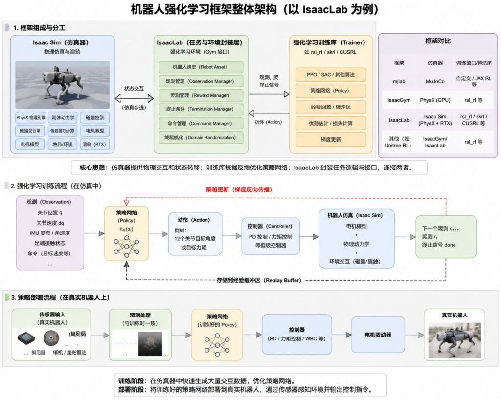

## 写在前面

由于isaaclab版本频繁更新导致环境依赖混乱，如果出现环境依赖相关的问题，建议借助AI

## robot\_lab介绍

robot\_lab以其网络结构简单，环境设置，机器人设置全面作为入门Isaaclab是一个十分好的选择

robot\_lab项目地址：[fan-ziqi/robot\_lab: RL Extension Library for Robots, Based on IsaacLab.](https://github.com/fan-ziqi/robot_lab)

## **运行环境**：

**系统**：Ubuntu 22.04

**Isaaclab版本**：2.3.2

## 项目结构

在开始之前我们初步了解一下Isaaclab的整个项目结构

<figure>

<figure>



<figcaption>

isaaclab官方文档中对于整个项目结构的划分

</figcaption>

</figure>


</figure>

在最外层的robot\_lab文件夹下就是整个项目，分别将脚本，资源，文档等分到了不同的文件夹下，在此只讨论比较复杂的scripts和source文件


scripts文件夹下就是包含了训练要用到的所有脚本，以后添加脚本也放到这个文件夹下，scripts下有tool和reinforcement\_learning两个文件夹，顾名思义一个放工具相关的比如说zero\_agent.py可以用来观察新建的训练环境是否正确



另一个放训练相关的，在这个文件夹下有cusrl, rsl\_rl, skrl三个文件夹分别对应三个不同的强化学习训练库，我们在此也只讨论笔者常用的rsl\_rl训练库，在rsl\_rl下就可以看到play.py和train.py两个训练脚本了一个用来训练模型，另一个用来在isaacsim中展示训练好的模型，到这里为止scripts常用的几个脚本就过完了

接下来我们讨论整个项目下最核心的内容source文件夹下的内容


图中extension这一层主要用于pip安装以及Isaac Sim Kit拓展识别，使得资源可以import到训练脚本里，这层我们几乎不改所以也不做过多讨论

不过值得一提的是robotlab将机器人的urdf资源放到了这一层的data文件夹下，之后加入自己的机器人的时候也能放到这里


再下来就是modules，这一部分是整个代码的核心，我们注意到这一层下面包含task和assets两个文件夹，assets用来存放训练中对于机器人的配置，task则用来存放除机器人以外的训练配置，在task文件夹下有direct和manger\_base两个文件夹表示两个代码形式，我们在此只针对manger\_base讨论，因为这种代码形式将地形，奖励，终止条件等训练的内容等分开设置，更容易管理



assets放到task外面也是因为task下两种代码形式都会用到assets下的机器人配置，所以放到task文件夹外面

最后我们看到task层，这一层下也有两个文件夹分别是beyondmimic和locomotion，beyondmimic主要用于模仿学习，训练特殊动作，在robot\_lab下也只用于人形，所以我们也只讨论locomotion，这个文件夹下也就只有velocity了，关于训练任务的注册，训练环境的配置都在这个里面，之后会详细讨论

到此为止我们就基本过完了整个robotlab项目结构，同时也对isaaclab的结构划分有一个大致的了解

接下来我们就关注于内容了，在接下来的内容里我们也主要关注的是velocity文件夹下的内容

<figure>



<figcaption>

GPT生成的结构图，以便理解

</figcaption>

</figure>

对于市面上无论是哪一个训练框架,比如说mjlab,unilab还是isaacgym，都是由仿真器和训练器组成，仿真器提供仿真环境，比如说状态转移，物理交互，动力学仿真之类的内容，训练器负责收集仿真器中得到的数据去训练网络。isaaclab也是如此，其中isaacsim负责仿真，训练则是由rsl\_rl, cusrl之类的强化学习训练库来实现

因此对于isaaclab的训练任务也主要通过设置仿真环境和训练配置来注册

其中仿真环境设置也就是velocity下velocity\_env\_cfg中配置的内容，另一部分的训练配置比如说PPO算法，也就是rsl\_rl部分设置的内容。在训练任务的Register也主要是处理这两部分,以A1的任务注册为例

```
# robot_lab\source\robot_lab\robot_lab\tasks\manager_based\locomotion\velocity\config\quadruped\unitree_a1\__init__.py

gym.register(
    id="RobotLab-Isaac-Velocity-Rough-Unitree-A1-v0",
    entry_point="isaaclab.envs:ManagerBasedRLEnv",
    disable_env_checker=True,
    kwargs={
        "env_cfg_entry_point": f"{__name__}.rough_env_cfg:UnitreeA1RoughEnvCfg",                                          # 环境设置
# UnitreeA1RoughEnvCfg继承velocity_env_cfg中的类便于对不同机器人特化调参
        "rsl_rl_cfg_entry_point": f"{agents.__name__}.rsl_rl_ppo_cfg:UnitreeA1RoughPPORunnerCfg",      # 训练设置
        "cusrl_cfg_entry_point": f"{agents.__name__}.cusrl_ppo_cfg:UnitreeA1RoughTrainerCfg",          # 暂时不考虑cusrl
    },
)
```

其中UnitreeA1RoughEnvCfg就是训练的环境设置，来自于\_\_init\_\_.py同目录下的rough\_env\_cfg.py，该文件主要是对于继承自LocomotionVelocityRoughEnvCfg的UnitreeA1RoughEnvCfg类的详细配置，LocomotionVelocityRoughEnvCfg类是在velocity\_env\_cfg.py类中实现的通用于所有机器人的环境配置的基类，对于不同的机器人只要继承这个类做一些单独的参数修改就行。

如果只是想把自己的四足机器人移植到robot\_lab框架中在[快速开始](http://tonightrain.top/2026/04/05/isaaclab%e4%b8%ad%e5%af%bc%e5%85%a5%e8%87%aa%e5%b7%b1%e7%9a%84%e6%a8%a1%e5%9e%8b%e8%bf%9b%e8%a1%8c%e8%ae%ad%e7%bb%83/)中实现

UnitreeA1RoughPPORunnerCfg就是对于这个训练任务的PPO算法参数配置, 具体配置在[rsl\_rl配置](http://tonightrain.top/2026/04/06/rsl_rl%e5%bc%ba%e5%8c%96%e5%ad%a6%e4%b9%a0%e6%a1%86%e6%9e%b6%e5%9c%a8isaaclab%e4%b8%ad%e7%9a%84%e9%85%8d%e7%bd%ae/)里说明

UnitreeA1RoughEnvCfg是对于这个训练任务的环境配置，具体配置方法在[环境配置](http://tonightrain.top/2026/03/30/robot_lab%e5%ad%a6%e4%b9%a0%e7%ac%94%e8%ae%b0-env_cfg/)中介绍
