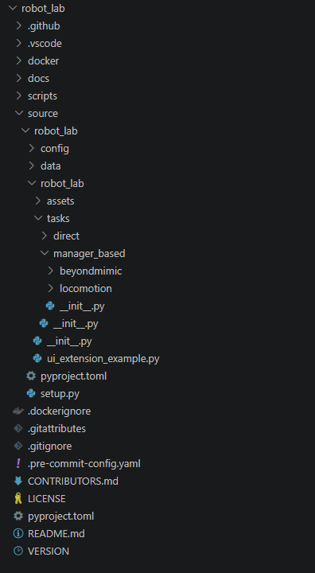
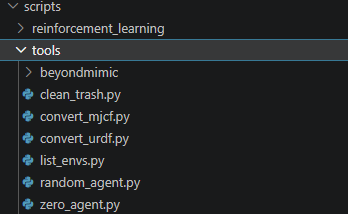
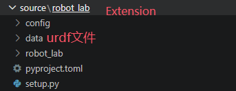
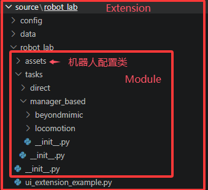
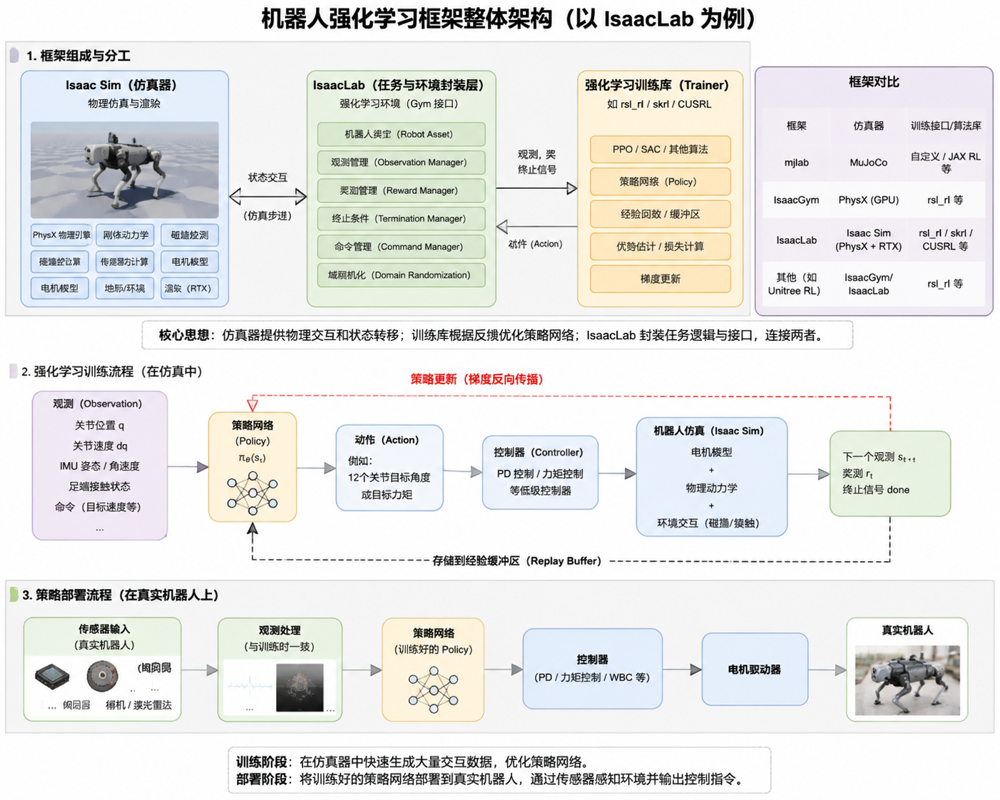

# 从robot\_lab开始的Isaaclab教程

# 总体介绍

## 写在前面

由于isaaclab版本频繁更新导致环境依赖混乱，如果出现环境依赖相关的问题，建议借助AI

另外欢迎关注我的个人网站：http://tonightrain.top/

## robot\_lab介绍

robot\_lab以其网络结构简单，环境，机器人设置全面作为入门Isaaclab是一个十分好的选择

robot\_lab项目地址：[fan\-ziqi/robot\_lab: RL Extension Library for Robots, Based on IsaacLab\.](https://github.com/fan-ziqi/robot_lab)

## **运行环境**：

**系统**：Ubuntu 22\.04

**Isaaclab版本**：2\.3\.2

## 项目结构

在开始之前我们初步了解一下Isaaclab的整个项目结构


<table>
  <tr>
    <td align="center"></td>
    <td align="center"></td>
  </tr>
</table>


在最外层的robot\_lab文件夹下就是整个项目，分别将脚本，资源，文档等分到了不同的文件夹下，在此只讨论比较复杂的scripts和source文件



scripts文件夹下就是包含了训练要用到的所有脚本，以后添加脚本也放到这个文件夹下，scripts下有tool和reinforcement\_learning两个文件夹，顾名思义一个放工具相关的比如说zero\_agent\.py可以用来观察新建的训练环境是否正确


另一个放训练相关的，在这个文件夹下有cusrl, rsl\_rl, skrl三个文件夹分别对应三个不同的强化学习训练库，我们在此也只讨论笔者常用的rsl\_rl训练库，在rsl\_rl下就可以看到play\.py和train\.py两个训练脚本了一个用来训练模型，另一个用来在isaacsim中展示训练好的模型，到这里为止scripts常用的几个脚本就过完了

接下来我们讨论整个项目下最核心的内容source文件夹下的内容



图中extension这一层主要用于pip安装以及Isaac Sim Kit拓展识别，使得资源可以import到训练脚本里，这层我们几乎不改所以也不做过多讨论

不过值得一提的是robotlab将机器人的urdf资源放到了这一层的data文件夹下，之后加入自己的机器人的时候也能放到这里



再下来就是modules，这一部分是整个代码的核心，我们注意到这一层下面包含task和assets两个文件夹，assets用来存放训练中对于机器人的配置，task则用来存放除机器人以外的训练配置，在task文件夹下有direct和manger\_base两个文件夹表示两个代码形式，我们在此只针对manger\_base讨论，因为这种代码形式将地形，奖励，终止条件等训练的内容等分开设置，更容易管理

assets放到task外面也是因为task下两种代码形式都会用到assets下的机器人配置，所以放到task文件夹外面


最后我们看到task层，这一层下也有两个文件夹分别是beyondmimic和locomotion，beyondmimic主要用于模仿学习，训练特殊动作，在robot\_lab下也只用于人形，所以我们也只讨论locomotion，这个文件夹下也就只有velocity了，关于训练任务的注册，训练环境的配置都在这个里面，之后会详细讨论

到此为止我们就基本过完了整个robotlab项目结构，同时也对isaaclab的结构划分有一个大致的了解

接下来我们就关注于内容了，在接下来的内容里我们也主要关注的是velocity文件夹下的内容



对于市面上无论是哪一个训练框架,比如说mjlab,unilab还是isaacgym，都是由仿真器和训练器组成，仿真器提供仿真环境，比如说状态转移，物理交互，动力学仿真之类的内容，训练器负责收集仿真器中得到的数据去训练网络。isaaclab也是如此，其中isaacsim负责仿真，训练则是由rsl\_rl, cusrl之类的强化学习训练库来实现

因此对于isaaclab的训练任务也主要通过设置仿真环境和训练配置来注册

其中仿真环境设置也就是velocity下velocity\_env\_cfg中配置的内容，另一部分的训练配置比如说PPO算法，也就是rsl\_rl部分设置的内容。在训练任务的Register也主要是处理这两部分,以A1的任务注册为例

```Plaintext
# robot_lab\source\robot_lab\robot_lab\tasks\manager_based\locomotion\velocity\config\quadruped\unitree_a1\__init__.py

gym.register(
    id="RobotLab-Isaac-Velocity-Rough-Unitree-A1-v0",
    entry_point="isaaclab.envs:ManagerBasedRLEnv",
    disable_env_checker=True,
    kwargs={
        "env_cfg_entry_point": f"{__name__}.rough_env_cfg:UnitreeA1RoughEnvCfg",                                          # 环境设置
# UnitreeA1RoughEnvCfg继承velocity_env_cfg中的类便于对不同机器人特化调参
        "rsl_rl_cfg_entry_point": f"{agents.__name__}.rsl_rl_ppo_cfg:UnitreeA1RoughPPORunnerCfg",      # 训练设置
        "cusrl_cfg_entry_point": f"{agents.__name__}.cusrl_ppo_cfg:UnitreeA1RoughTrainerCfg",          # 暂时不考虑cusrl
    },
)
```

其中UnitreeA1RoughEnvCfg就是训练的环境设置，来自于\_\_init\_\_\.py同目录下的rough\_env\_cfg\.py，该文件主要是对于继承自LocomotionVelocityRoughEnvCfg的UnitreeA1RoughEnvCfg类的详细配置，LocomotionVelocityRoughEnvCfg类是在velocity\_env\_cfg\.py类中实现的通用于所有机器人的环境配置的基类，对于不同的机器人只要继承这个类做一些单独的参数修改就行。

## 文档阅读说明

如果只是想把自己的四足机器人移植到robot\_lab框架中在[快速开始](https://mcn06ejdkuyu.feishu.cn/wiki/V64Xw10fJiqHAakcyT9cbqx5nMg?fromScene=spaceOverview#share-TAXadi3Ivo1tN6x6emIcZ0SZnid)中实现

UnitreeA1RoughPPORunnerCfg就是对于这个训练任务的PPO算法参数配置, 具体配置在[rsl\_rl配置](https://mcn06ejdkuyu.feishu.cn/wiki/V64Xw10fJiqHAakcyT9cbqx5nMg?fromScene=spaceOverview#share-VzkHduLA9oSRncxePF3chL6Lnsd)里说明

UnitreeA1RoughEnvCfg是对于这个训练任务的环境配置，具体配置方法在[环境配置](https://mcn06ejdkuyu.feishu.cn/wiki/V64Xw10fJiqHAakcyT9cbqx5nMg?fromScene=spaceOverview#share-TNVNdBN1MoZ23pxpT22cyHHYnrd)中介绍

# 快速开始

在[总体介绍](https://mcn06ejdkuyu.feishu.cn/wiki/V64Xw10fJiqHAakcyT9cbqx5nMg?fromScene=spaceOverview#share-SlHbd9DTYoN8xNx9WIicnhYJnPc)中我们了解了robotlab的项目结构，通过他我们可以了解到如果只是希望将自己的机器人加到这个训练框架里，只要将机器人配置文件配置即可，该框架下的机器人都放在了robot\_lab\\source\\robot\_lab\\robot\_lab\\assets目录下，所以可以仿照现有的配置文件，只将urdf配置替换，即将ArticulationCfg下的asset\_path替换

这里以A1为例，具体参考哪个机器人按照自己的自由度机器人需求：

```Plaintext

UNITREE_A1_CFG = ArticulationCfg(
    spawn=sim_utils.UrdfFileCfg(
        fix_base=False,
        merge_fixed_joints=True,
        replace_cylinders_with_capsules=False,
        asset_path=f"{ISAACLAB_ASSETS_DATA_DIR}/Robots/unitree/a1_description/urdf/a1.urdf",         # 替换这个
        activate_contact_sensors=True,
        rigid_props=sim_utils.RigidBodyPropertiesCfg(
            disable_gravity=False,
            retain_accelerations=False,
            linear_damping=0.0,
            angular_damping=0.0,
            max_linear_velocity=1000.0,
            max_angular_velocity=1000.0,
            max_depenetration_velocity=1.0,
        ),
        articulation_props=sim_utils.ArticulationRootPropertiesCfg(
            enabled_self_collisions=False, solver_position_iteration_count=4, solver_velocity_iteration_count=0
        ),
        joint_drive=sim_utils.UrdfConverterCfg.JointDriveCfg(
            gains=sim_utils.UrdfConverterCfg.JointDriveCfg.PDGainsCfg(stiffness=0, damping=0)
        ),
    ),
    init_state=ArticulationCfg.InitialStateCfg(
        pos=(0.0, 0.0, 0.38),
        joint_pos={
            ".*L_hip_joint": 0.0,
            ".*R_hip_joint": -0.0,
            "F.*_thigh_joint": 0.8,
            "R.*_thigh_joint": 0.8,
            ".*_calf_joint": -1.5,
        },
        joint_vel={".*": 0.0},
    ),
    soft_joint_pos_limit_factor=0.9,
    actuators={
        "legs": DCMotorCfg(
            joint_names_expr=[".*_joint"],
            effort_limit=33.5,
            saturation_effort=33.5,
            velocity_limit=21.0,
            stiffness=20.0,
            damping=0.5,
            friction=0.0,
        ),
    },
)
```

根据实际情况对部分参数也可以做实际微调，比如说`InitialStateCfg`的关节初始角，`soft_joint_pos_limit_factor`仿真器关节角度软约束，以及`actuators`配置中的`DCMotorCfg`电机类进行修改比如修改stiffness和damping，这两个参数对应实际电机的PD控制器的Kp和Kd，或者观察实机关节相应延迟,将关节类换成`DelayedPDActuator`，可以加入时间步为单位个延时具体配置可以[参考文档](https://mcn06ejdkuyu.feishu.cn/wiki/RRiYw7N43iTRNpkgDNsc3k5fnrd?fromScene=spaceOverview#share-R18VdhOZaoM5JfxQG9ScO4rDnGf)


将机器人配置的CFG配置好后就可以仿照现有的环境配置替换掉环境设置中的机器人配置了

依旧按照A1机器人为例

```Plaintext
# 内容来自于robot_lab\source\robot_lab\robot_lab\tasks\manager_based\locomotion\velocity\config\quadruped\unitree_a1\rough_env_cfg.py

@configclass
class UnitreeA1RoughEnvCfg(LocomotionVelocityRoughEnvCfg):                        # 名字不要忘记改了
    base_link_name = "base"
    foot_link_name = ".*_foot"
    # fmt: off
    joint_names = [
        "FR_hip_joint", "FR_thigh_joint", "FR_calf_joint",
        "FL_hip_joint", "FL_thigh_joint", "FL_calf_joint",
        "RR_hip_joint", "RR_thigh_joint", "RR_calf_joint",
        "RL_hip_joint", "RL_thigh_joint", "RL_calf_joint",
    ]
    # fmt: on

    def __post_init__(self):
        # post init of parent
        super().__post_init__()

        # ------------------------------Sence------------------------------
        self.scene.robot = UNITREE_A1_CFG.replace(prim_path="{ENV_REGEX_NS}/Robot")           #将这里UNITREE_A1_CFG替换
        self.scene.height_scanner.prim_path = "{ENV_REGEX_NS}/Robot/" + self.base_link_name
        self.scene.height_scanner_base.prim_path = "{ENV_REGEX_NS}/Robot/" + self.base_link_name
```

最后注册任务

```Plaintext
gym.register(
    id="RobotLab-Isaac-Velocity-Rough-Unitree-A1-v0",
    entry_point="isaaclab.envs:ManagerBasedRLEnv",
    disable_env_checker=True,
    kwargs={
        "env_cfg_entry_point": f"{__name__}.rough_env_cfg:UnitreeA1RoughEnvCfg",                  # 替换掉这个
        "rsl_rl_cfg_entry_point": f"{agents.__name__}.rsl_rl_ppo_cfg:UnitreeA1RoughPPORunnerCfg", # 这个如设置也可以替换
        "cusrl_cfg_entry_point": f"{agents.__name__}.cusrl_ppo_cfg:UnitreeA1RoughTrainerCfg",
    },
)
```

最后记得install一下，方便训练脚本可以导入库

```Plaintext
python -m pip install -e source/robot_lab
```

这样就可以开始训练了

# 环境配置

这里我们将讲解训练环境的配置，首先我们可以先将velocity\_env\_cfg\.py翻倒最下面，看到LocomotionVelocityRoughEnvCfg的配置，这里就是将上面的详细环境配置集合过来作为一个基类，供机器人调用，通过这个类我们也可以看到，环境配置主要分8大类分别是

```Plaintext
@configclass
class DoggedGymEnvCfg(ManagerBasedRLEnvCfg):
    # Scene settings
    scene: DoggedGymSceneCfg = DoggedGymSceneCfg(
        num_envs=4096,
        env_spacing=2.5,
    )

    # Basic settings
    observations: ObservationsCfg = ObservationsCfg()
    actions: ActionsCfg = ActionsCfg()
    commands: CommandsCfg = CommandsCfg()

    # MDP settings
    rewards: RewardsCfg = RewardsCfg()
    terminations: TerminationsCfg = TerminationsCfg()
    events: EventCfg = EventCfg()
    curriculum: CurriculumCfg = CurriculumCfg()

    def __post_init__(self):
        self.decimation = 4
        self.episode_length_s = 40.0
        self.sim.dt = 0.005
        self.sim.render_interval = self.decimation
```

**scene**：针对机器人和地形，光照等物理环境的配置

**observations**：配置网络输入，在这里就是配置actor，critic两个网络的输入

**actions**：策略输出设置

**commands**：遥控指令配置

**rewards**：奖励函数配置

**terminations**：终止条件配置，如因出界，超时等的中止

**events**：随机化配置，如出场为止随机，身体质量的随机

**curriculum**：课程设置，用于逐渐增加地形难度或

在当前策略中：

```Plaintext
物理仿真频率 = 1 / sim.dt = 200 Hz
策略频率     = 1 / (sim.dt * decimation) = 50 Hz
单回合步数   = episode_length_s / (sim.dt * decimation) = 2000
```

`__post_init__` 是配置对象完成初始化后的处理入口，适合做派生字段设置和子类覆盖。它不是每个 episode 的 reset 回调

由于**actions**，**observations**，**curriculum**不常做修改因此不在这里详细说明

## Scene配置

在做一切之前肯定是要先把物理环境给搭起来

在isaaclab中需要通过TerrainImporterCfg设置地形，来自\_class\_ isaaclab\.terrains\.TerrainImporterCfg

```Plaintext
# ground terrain
    terrain = TerrainImporterCfg(
        prim_path="/World/ground",                                # 地形在 USD Stage 中的根路径
        terrain_type="generator",                                 # 使用程序化生成器创建地形
        terrain_generator=ROUGH_TERRAINS_CFG,                     # 使用 Isaac Lab 预定义的配置,在下面也会讲自己定义地形配置
        max_init_terrain_level=5,                                 # 初始化时，机器人随机分配到 0～5 级地形
        collision_group=-1,                                       # 使所有克隆环境中的机器人都能与同一块地形碰撞
        physics_material=sim_utils.RigidBodyMaterialCfg(
            friction_combine_mode="multiply",                     # 地面与机器人材质接触时，两个摩擦系数相乘
            restitution_combine_mode="multiply",                  # 两个恢复系数相乘
            static_friction=1.0,                                  # 静摩擦系数
            dynamic_friction=1.0,                                 # 动摩擦系数
            restitution=1.0,                                      # 恢复系数，控制碰撞反弹程度，1 表示完全弹性碰撞
        ),
        visual_material=sim_utils.MdlFileCfg(                     # 外观纹理配置，不影响物理属性
            mdl_path=f"{ISAACLAB_NUCLEUS_DIR}/Materials/TilesMarbleSpiderWhiteBrickBondHoned/TilesMarbleSpiderWhiteBrickBondHoned.mdl", #素材库加载材质
            project_uvw=True,                                     # 对生成的地形投影纹理坐标
            texture_scale=(0.25, 0.25),                           # 设置 U、V 两个方向的纹理缩放，改变纹理密度
        ),
        debug_vis=False,
    )
```

详细可配置参数可参考[附件](https://mcn06ejdkuyu.feishu.cn/wiki/V64Xw10fJiqHAakcyT9cbqx5nMg?fromScene=spaceOverview#share-PFDOdyU6LozaHpxLX4vcwIJinLh)

接下来我们进行传感器的配置，高度扫描类传感器通常通过RayCasterCfg配置

```Plaintext
height_scanner = RayCasterCfg(
        prim_path="{ENV_REGEX_NS}/Robot/base",                                # 传感器自身挂载的位置
        offset=RayCasterCfg.OffsetCfg(pos=(0.0, 0.0, 20.0)),                  # 传感器相对于挂载link的偏移位姿
        ray_alignment="yaw",                                                  # 指定射线跟随哪个坐标系，它决定：机器人运动或者旋转时，射线方向怎么变化，这里的设置表示身体pitch变化，但是ray保持水平：
        pattern_cfg=patterns.GridPatternCfg(resolution=0.1, size=[1.6, 1.0]), # 定义射线的数量、起点位置和方向分布
        debug_vis=False,                                                      # 是否显示射线可视化
        mesh_prim_paths=["/World/ground"],                                    # 射线检测的目标的列表，这里表示只检测地面
    )
```

详细可配置参数可参考[附件](https://mcn06ejdkuyu.feishu.cn/wiki/V64Xw10fJiqHAakcyT9cbqx5nMg?fromScene=spaceOverview#share-YftAdOQ13oXeLxx3opRcEJTanrh)

再接下来我们来配置接触传感器，通过**ContactSensorCfg**类来配置

```Plaintext
contact_forces = ContactSensorCfg(prim_path="{ENV_REGEX_NS}/Robot/.*", # 传感器挂载的 USD Prim 路径
                                                  history_length=3,        # 保存多少历史帧的接触数据
                                                  track_air_time=True)     # 是否记录脚离开地面的时间和接触持续时间,在下面的reward的步态约束有使用到
```

详细可配置参数可参考[附件](https://mcn06ejdkuyu.feishu.cn/wiki/V64Xw10fJiqHAakcyT9cbqx5nMg?fromScene=spaceOverview#share-BtFrdTCOJox47gxCmnfcTdqmnFg)

接下来我们要对天空进行配置，要注意天空属于一种asset, 因此我们要通过AssetBaseCfg进行配置

```Plaintext
sky_light = AssetBaseCfg(
        prim_path="/World/skyLight",  # 资产在 Isaac Sim 场景树中的路径
        spawn=sim_utils.DomeLightCfg(
            intensity=750.0,          # 光照强度
            texture_file=f"{ISAAC_NUCLEUS_DIR}/Materials/Textures/Skies/PolyHaven/kloofendal_43d_clear_puresky_4k.hdr", # 天空环境纹理文件
        ),
    )
```

详细可配置参数可参考[附件](https://mcn06ejdkuyu.feishu.cn/wiki/V64Xw10fJiqHAakcyT9cbqx5nMg?fromScene=spaceOverview#share-V1iydcMSYo5lxIxXZ2gc9c2wn3G)

至此SceneCfg配置完了

## Reward配置

接下来我们来讲rewards的配置，rewards配置主要分两种，一种是直接通过函数实现不停调用的奖励函数，另一种是继承ManagerTermBase类实现更复杂的奖励函数配置，不过两种奖励函数都必须要返回返回 `[num_envs]` 张量，作为机器人的奖励

首先我们来看到第一种，以xy平面上的角速度跟踪奖励为实例：

```Plaintext
def ang_vel_xy_l2(env: ManagerBasedRLEnv, asset_cfg: SceneEntityCfg = SceneEntityCfg("robot")) -> torch.Tensor:
    //获取训练环境的资产
    asset: RigidObject = env.scene[asset_cfg.name]
    //通过资产获取机器人base的xy平面的的角速度，获取一个[num_envs, 2]的tensor,再通过square和sum把他变成一个[num_envs]维度的tensor，每一维都放着各自环境的奖励
    reward = torch.sum(torch.square(asset.data.root_ang_vel_b[:, :2]), dim=1)
    //在奖励输出前乘一个机器人自身方向表示直立程度，表示姿态稳定性权重因子
    reward *= torch.clamp(-env.scene["robot"].data.projected_gravity_b[:, 2], 0, 0.7) / 0.7
    //输出奖励
    return reward
```

这种比较简单，只要保证这个函数输出的是一个env数量维度的tensor，每一维都放着各自环境的奖励，最后再RewardCfg里注册即可

```Plaintext
ang_vel_xy_l2 = RewTerm(func=mdp.ang_vel_xy_l2, weight=0.0)
```

在这里注册的奖励函数weight设成了0,之后要在继承了这个子类的机器人中设成非0值

我们再来看到另外一种奖励函数的配置，以步态约束为例，步态约束是`GaitReward`继承了`ManagerTermBase`类实现的

我们暂时忽略`_sync_reward_func`和`_async_reward_func`这两个helper函数的实现主要关注`__init__`和`__call__`这两个函数，这两个才是`ManagerTermBase`类的核心，`__init__`函数在环境创建后触发，`__call__`则像普通的奖励函数那样不断触发

首先我们看到`__init__`函数

```Plaintext
def __init__(self, cfg: RewTerm, env: ManagerBasedRLEnv):
        """Initialize the term.

        Args:
            cfg: The configuration of the reward.
            env: The RL environment instance.
        """
        #调用父类构造函数
        super().__init__(cfg, env)
        #从配置中读取超参数
        self.std: float = cfg.params["std"]
        self.command_name: str = cfg.params["command_name"]
        self.max_err: float = cfg.params["max_err"]
        self.velocity_threshold: float = cfg.params["velocity_threshold"]
        self.command_threshold: float = cfg.params["command_threshold"]
        #获取场景中的传感器和机器人本体
        self.contact_sensor: ContactSensor = env.scene.sensors[cfg.params["sensor_cfg"].name]
        self.asset: Articulation = env.scene[cfg.params["asset_cfg"].name]
        #保证脚数和组数正确，要保证步态正确就要保证有两组脚同时每组有两只脚
        synced_feet_pair_names = cfg.params["synced_feet_pair_names"]
        if (
            len(synced_feet_pair_names) != 2
            or len(synced_feet_pair_names[0]) != 2
            or len(synced_feet_pair_names[1]) != 2
        ):
            raise ValueError("This reward only supports gaits with two pairs of synchronized feet, like trotting.")
        #通过find_bodies获取机器人脚的索引，最后在synced_feet_pairs得到两组脚各脚的二维数组
        #find_bodies返回的是[body_idx,body_name],我们只要前面那个就行了于是取[0]
        synced_feet_pair_0 = self.contact_sensor.find_bodies(synced_feet_pair_names[0])[0]
        synced_feet_pair_1 = self.contact_sensor.find_bodies(synced_feet_pair_names[1])[0]
        #最后将索引组合
        self.synced_feet_pairs = [synced_feet_pair_0, synced_feet_pair_1]
```

在这里我们可以看到在`__init__`函数里主要做的都是预处理相关的工作，便于我们在`__call__`函数里作使用

```Plaintext
def __call__(
        self,
        env: ManagerBasedRLEnv,
        std: float,
        command_name: str,
        max_err: float,
        velocity_threshold: float,
        command_threshold: float,
        synced_feet_pair_names,
        asset_cfg: SceneEntityCfg,
        sensor_cfg: SceneEntityCfg,
    ) -> torch.Tensor:
        """Compute the reward.

        This reward is defined as a multiplication between six terms where two of them enforce pair feet
        being in sync and the other four rewards if all the other remaining pairs are out of sync

        Args:
            env: The RL environment instance.
        Returns:
            The reward value.
        """
        # 检查应当同步的腿的同步时长，同步时间越长奖励越大
        sync_reward_0 = self._sync_reward_func(self.synced_feet_pairs[0][0], self.synced_feet_pairs[0][1])
        sync_reward_1 = self._sync_reward_func(self.synced_feet_pairs[1][0], self.synced_feet_pairs[1][1])
        # 将不同组的结果通过乘融合
        sync_reward = sync_reward_0 * sync_reward_1
        # 检查不该同步的腿组的非同步时长，非同步时间越长奖励越大
        async_reward_0 = self._async_reward_func(self.synced_feet_pairs[0][0], self.synced_feet_pairs[1][0])
        async_reward_1 = self._async_reward_func(self.synced_feet_pairs[0][1], self.synced_feet_pairs[1][1])
        async_reward_2 = self._async_reward_func(self.synced_feet_pairs[0][0], self.synced_feet_pairs[1][1])
        async_reward_3 = self._async_reward_func(self.synced_feet_pairs[1][0], self.synced_feet_pairs[0][1])
        # 将不同组的结果通过乘融合
        async_reward = async_reward_0 * async_reward_1 * async_reward_2 * async_reward_3
        # 门控，保证只有真的在行走时才强制步态
        # 判断当前速度指令的大小（范数）
        cmd = torch.linalg.norm(env.command_manager.get_command(self.command_name), dim=1)
        # 机器人质心在x, y平面上的速度
        body_vel = torch.linalg.norm(self.asset.data.root_com_lin_vel_b[:, :2], dim=1)
        # 当指令较大或机器人已经在运动时，才施加步态奖励,否则奖励为 0
        reward = torch.where(
            torch.logical_or(cmd > self.command_threshold, body_vel > self.velocity_threshold),
            sync_reward * async_reward,
            0.0,
        )
        # 姿态加权，保证在直立情况下才能得到完整奖励
        reward *= torch.clamp(-env.scene["robot"].data.projected_gravity_b[:, 2], 0, 0.7) / 0.7
        # 输出奖励
        return reward
```

ManagerTermBase除了像这样使用以外，还可以用来实现一次性触发的奖励，如在翻越高墙时要将腿抬到指定高度后才能得到奖励，这种时候就要引入`reset()`函数，也是属于`ManagerTermBase`类的函数, 该函数在环境触发termination后重启时触发，可以用来清空状态

例如:

```Plaintext
def reset(self, env_ids: Sequence[int] | None = None) -> None:
        if env_ids is None:
            env_ids = slice(None)
        self.triggered[env_ids] = False
```

最后记得注册函数

```Plaintext
feet_gait = RewTerm(
    func=mdp.GaitReward,
    weight=0.5,
    params={
        "std": math.sqrt(0.5),
        "command_name": "base_velocity",
        "max_err": 0.2,
        "velocity_threshold": 0.5,
        "command_threshold": 0.1,
        "synced_feet_pair_names": (
            ("FL_calf", "RR_calf"),
            ("FR_calf", "RL_calf"),
        ),
        "asset_cfg": SceneEntityCfg("robot"),
        "sensor_cfg": SceneEntityCfg("contact_forces"),
    },
)
```

在实际的Reward Manager中，reward是这样计算的

```Plaintext
reward = sum(term_value * term_weight * env.step_dt)
```

在实际训练中，只要奖励函数完成了，那么只调整term\_weight或者奖励函数中的各种阈值就够了，在robot\_lab的使用中也可以看到，继承了基类的机器人调整的奖励函数也基本上是这几个

还有一个要注意的是，在奖励函数的权重设置中要分正负，比如我们鼓励产生我们设定的步态那么权重就给正，但是在前面的角速度跟随的奖励函数中我们的函数得到的是和指定角速度的误差因此在设定权重中我们要设定负数

## Command配置

速度指令配置定义了机器人需要追踪的目标：

```Plaintext
@configclass
class CommandsCfg:
    base_velocity = mdp.UniformThresholdVelocityCommandCfg(
        asset_name="robot",
        resampling_time_range=(10.0, 10.0),
        rel_standing_envs=0.02,
        rel_heading_envs=1.0,
        heading_command=True,
        heading_control_stiffness=0.5,
        debug_vis=True,
        ranges=mdp.UniformThresholdVelocityCommandCfg.Ranges(
            lin_vel_x=(-1.0, 1.0),
            lin_vel_y=(-1.0, 1.0),
            ang_vel_z=(-1.0, 1.0),
            heading=(-math.pi, math.pi),
        ),
    )
```

这里我们主要讲自定义command的代码实现

自定义command时主要有3个生命周期接口

|方法|调用时机|典型用途|
|---|---|---|
|`__init__`|command term 创建时|分配缓存、保存配置|
|`_resample_command(env_ids)`|指定环境需要重采样时|生成新目标|
|`_update_command()`|每个环境步|根据 heading 或地形修正当前目标|

下面来看具体的代码实现

```Plaintext
class UniformThresholdVelocityCommand(mdp.UniformVelocityCommand):
    """Command generator that generates a velocity command in SE(2) from uniform distribution with threshold.

    This command generator automatically detects "pits" terrain and applies restrictions:
    - For pit terrains: only allow forward movement (no lateral or rotational movement)
    """

    cfg: mdp.UniformThresholdVelocityCommandCfg  # type: ignore
    """The configuration of the command generator."""

    def __init__(self, cfg: mdp.UniformThresholdVelocityCommandCfg, env: ManagerBasedEnv):
        """Initialize the command generator.

        Args:
            cfg: The configuration of the command generator.
            env: The environment.
        """
        # 初始化先调用父类的初始化
        super().__init__(cfg, env)
        # 提前初始化判断机器人是否在pit中的参数（在robotlab中，并没有看到和pit相关的地形，应该是预留的接口）
        self.was_on_pit = torch.zeros(self.num_envs, dtype=torch.bool, device=self.device)

    def _resample_command(self, env_ids: Sequence[int]):
        # 在到设定期间后触发速度重采样
        super()._resample_command(env_ids)
        # 将速度过小的速度设置为0，方便类似于stand_still的奖励函数触发
        self.vel_command_b[env_ids, :2] *= (torch.norm(self.vel_command_b[env_ids, :2], dim=1) > 0.2).unsqueeze(1)

    def _update_command(self):
        """Update commands and apply terrain-aware restrictions in real-time.

        This function:
        1. Calls parent's update to handle heading and standing envs
        2. Checks which robots are currently on pit terrain
        3. For robots leaving pits: resamples their commands
        4. For robots on pits: restricts to forward-only movement and sets heading to 0
        """
        # 这个函数在运行时不断调用
        # 首先先初始化父类函数
        super()._update_command()

        # 判断是否机器人在pit中
        on_pits = is_robot_on_terrain(self._env, "pits")

        # 判断是否离开pit
        left_pit_mask = self.was_on_pit & ~on_pits
        # 对于离开pit的机器人
        if left_pit_mask.any():
            left_pit_env_ids = torch.where(left_pit_mask)[0]
            # 按照正常机器人采样
            self._resample_command(left_pit_env_ids)
        # 对于在pit中的机器人
        if on_pits.any():
            pit_env_ids = torch.where(on_pits)[0]
            # 强制机器人直线行驶
            self.vel_command_b[pit_env_ids, 0] = torch.clamp(
                torch.abs(self.vel_command_b[pit_env_ids, 0]), min=0.3, max=0.6
            )
            self.vel_command_b[pit_env_ids, 1] = 0.0  # no lateral movement
            self.vel_command_b[pit_env_ids, 2] = 0.0  # no yaw rotation
            # 保证其他参数置0,防止指令冲突
            if self.cfg.heading_command:
                self.heading_target[pit_env_ids] = 0.0

        # 更新指令状态
        self.was_on_pit = on_pits

# 配置指令设置
@configclass
class UniformThresholdVelocityCommandCfg(mdp.UniformVelocityCommandCfg):
    """Configuration for the uniform threshold velocity command generator."""

    class_type: type = UniformThresholdVelocityCommand
```

## Events设置

这一部分主要是设置仿真中的域随机化

先从域随机化的注册来说，在robot\_lab中使用的自定义域随机化只有重置机器人状态，主要参数为初始的速度和位置范围

```Plaintext
randomize_reset_base = EventTerm(
        func=mdp.reset_root_state_uniform,
        mode="reset",
        params={
            "pose_range": {"x": (-0.5, 0.5), "y": (-0.5, 0.5), "yaw": (-3.14, 3.14)},
            "velocity_range": {
                "x": (-0.5, 0.5),
                "y": (-0.5, 0.5),
                "z": (-0.5, 0.5),
                "roll": (-0.5, 0.5),
                "pitch": (-0.5, 0.5),
                "yaw": (-0.5, 0.5),
            },
        },
    )
```

域随机化设置需要配置除了域随机化函数中需要的参数以外，还需要设置触发时机也就是`mode`，常见的触发时机有以下几种

|mode|调用时机|常见用途|
|---|---|---|
|`startup`|环境启动时|材质、质量、质心等物理参数随机化|
|`reset`|指定并行环境重置时|随机初始姿态、关节状态|
|`interval`|随机时间间隔|推力、速度扰动等在线干扰|

接下来看到详细的实现

```Plaintext
def reset_root_state_uniform(
    env: ManagerBasedEnv,
    env_ids: torch.Tensor,
    pose_range: dict[str, tuple[float, float]],
    velocity_range: dict[str, tuple[float, float]],
    asset_cfg: SceneEntityCfg = SceneEntityCfg("robot"),
):
    # 首先获取目标资产
    asset: RigidObject | Articulation = env.scene[asset_cfg.name]

    # 区分pit环境和普通环境（robotlab中并没有看到pit环境的注册，因此可以忽略）
    assigned_to_pits = is_env_assigned_to_terrain(env, "pits")
    pit_env_ids = env_ids[assigned_to_pits[env_ids]]
    non_pit_env_ids = env_ids[~assigned_to_pits[env_ids]]

    # 如果有pit环境（可以忽略）
    if len(pit_env_ids) > 0:
        root_states = asset.data.default_root_state[pit_env_ids].clone()
        positions = root_states[:, 0:3] + env.scene.env_origins[pit_env_ids]
        orientations = root_states[:, 3:7]
        velocities = torch.zeros_like(root_states[:, 7:13])
        asset.write_root_pose_to_sim(torch.cat([positions, orientations], dim=-1), env_ids=pit_env_ids)
        asset.write_root_velocity_to_sim(velocities, env_ids=pit_env_ids)

    # 设置正常环境里的域随机化
    if len(non_pit_env_ids) > 0:
        # 获取环境中的默认位置
        root_states = asset.data.default_root_state[non_pit_env_ids].clone()

        # 按固定顺序 x, y, z, roll, pitch, yaw 取出范围写到列表里，字典里没写的键默认 (0, 0)（即不随机）
        range_list = [pose_range.get(key, (0.0, 0.0)) for key in ["x", "y", "z", "roll", "pitch", "yaw"]]
        # 将python列表转成torch的张量，方便计算
        ranges = torch.tensor(range_list, device=asset.device)
        # 用均匀分布采样一个形状为 (num_envs, 6) 的随机增量张量，6表示机器人的x, y, z, roll, pitch, yaw偏移
        rand_samples = math_utils.sample_uniform(
            ranges[:, 0], ranges[:, 1], (len(non_pit_env_ids), 6), device=asset.device
        )
    
        # 位置 = 默认位置 + 环境原点 + 随机平移量
        positions = root_states[:, 0:3] + env.scene.env_origins[non_pit_env_ids] + rand_samples[:, 0:3]
        # 把随机的 roll/pitch/yaw 转成四元数增量
        orientations_delta = math_utils.quat_from_euler_xyz(rand_samples[:, 3], rand_samples[:, 4], rand_samples[:, 5])
        # 再与默认四元数做四元数乘法（组合旋转），这样随机旋转是相对默认姿态叠加的
        orientations = math_utils.quat_mul(root_states[:, 3:7], orientations_delta)
        # velocities
        # 速度的域随机化，几乎和位置的一致
        # 获取速度范围采样
        range_list = [velocity_range.get(key, (0.0, 0.0)) for key in ["x", "y", "z", "roll", "pitch", "yaw"]]
        ranges = torch.tensor(range_list, device=asset.device)
        rand_samples = math_utils.sample_uniform(
            ranges[:, 0], ranges[:, 1], (len(non_pit_env_ids), 6), device=asset.device
        )
 
        # 同样按 6 自由度采样（3 个线速度 + 3 个角速度），加到默认速度上（默认通常为 0，即直接等于随机值）。
        velocities = root_states[:, 7:13] + rand_samples

        # 将随机化的结果写入仿真
        asset.write_root_pose_to_sim(torch.cat([positions, orientations], dim=-1), env_ids=non_pit_env_ids)
        asset.write_root_velocity_to_sim(velocities, env_ids=non_pit_env_ids)
```

## Terrain配置

在robotlab中，地形是使用的isaaclab自带的rough地形，但是考虑到自定义地形很常用，因此专门列一栏来讲

自定义地形环境可以通过引入`trimesh` 构造三角网格，之后由 Terrain Generator 合并并导入仿真

比如说我们创建一个比较简单的高墙地形

首先我们先封装两层trimesh的box，方便我们之后调用

```Plaintext
def _box(size: tuple[float, float, float], center: tuple[float, float, float]) -> trimesh.Trimesh:
    """Create an axis-aligned box mesh."""
    """
    transform形状定义
        ┌─ 旋转 3×3 ─┐ ┌ 平移 ┐
        │ Rx Rx Rx  │ │ tx   │
        │ Ry Ry Ry  │ │ ty   │
        │ Rz Rz Rz  │ │ tz   │
        └───────────┘ └──────┘
        │  0   0   0 │ │  1   │   ← 最后一行固定为 [0,0,0,1]
    """
    transform = np.eye(4)
    transform[:3, 3] = center
    return trimesh.creation.box(extents=size, transform=transform)

# 再将_box封装一层作为地面
def _track_ground(cfg: CompetitionObstacleTerrainCfg, track_width: float) -> trimesh.Trimesh:
    size_x, size_y = cfg.size
    thickness = cfg.ground_thickness
    track_width = min(track_width, size_y)
    return _box((size_x, track_width, thickness), (size_x / 2.0, size_y / 2.0, -thickness / 2.0))
```

继承subTerrainBase类，定义HighWallTerrainCfg，这里不止用来配置子地形，同时还定义地形相关的参数

```Plaintext
# base类，创建其他类似环境时调用
@configclass
class CompetitionObstacleTerrainCfg(SubTerrainBaseCfg):
    """Base config for one competition obstacle terrain."""

    function = None

    ground_thickness: float = 0.05
    start_x: float = 0.7
    obstacle_x: float = 4.0
    obstacle_y: float = 1.0
# 高墙地形类
@configclass
class HighWallTerrainCfg(CompetitionObstacleTerrainCfg):
    """Configuration for the high wall obstacle."""

    function = None
    wall_height: float = 0.035
    wall_length: float = 1.0
    wall_thickness: float = 0.05
    track_width: float = 1.0
```

接下来定义地形函数，通过提前封装的\_box函数组装地形形状，最后返回地形形状和地形起始点

```Plaintext
def high_wall_terrain(difficulty: float, cfg: HighWallTerrainCfg) -> tuple[list[trimesh.Trimesh], np.ndarray]:
    """Generate the high wall obstacle from the competition PDF dimensions."""
    # 定义地形难度
    difficulty = float(np.clip(difficulty, 0.0, 10.0))
    # 设置横向起始点
    y_mid = cfg.size[1] / 2.0
    # 设置高墙高度，高墙高度乘以地形难度，获得高度随难度变化而变化的高墙
    wall_height = cfg.wall_height * difficulty
    # 生成地面
    meshes = [_track_ground(cfg, cfg.track_width)]
    # 在制定位置加入高墙
    meshes.append(
        _box(
            (cfg.wall_thickness, cfg.wall_length, wall_height),
            (cfg.obstacle_x, y_mid, wall_height / 2.0),
        )
    )
    # 确定原点
    origin = np.array([cfg.start_x, y_mid, 0.0], dtype=np.float64)
    return meshes, origin
```

最后注册terrain,得到自定义的高墙地形HIGH\_WALL\_TERRAINS\_CFG，将这个地形和robotlab里的ROUGH\_TERRAINS\_CFG替换即可

```Plaintext
HIGH_WALL_TERRAINS_CFG = TerrainGeneratorCfg(
    size=(7.0, 2.0),
    border_width=0.0,
    num_rows=10,
    num_cols=5,
    difficulty_range=(0.0, 10.0),
    curriculum=True,
    sub_terrains={
        "high_wall": HighWallTerrainCfg(
            function=high_wall_terrain,
            proportion=1.0,
            size=(7.0, 2.0),
            track_width=1.0,
        )
    },
)
```

要注意的是我们刚才实现的函数是子地形，注册到HIGH\_WALL\_TERRAINS\_CFG会生成num\_rows \* num\_cols个子地形，其中num\_rows和terrain\_level相关，在环境注册里加入下面这行代码后，row 决定生成时的难度区间，难度从低到高排列。

```Plaintext
self.scene.terrain.terrain_generator.curriculum = True
```

## Termination配置

虽然在robotlab中也没有自定义的termination设置，但是考虑到随着地形的改变termination一般也会有所改变，所以我们这里也做一定讲解

在刚才生成的高墙地形中，由于旁边的虚空的存在，因此在机器人掉出去之后及时做处理，所以我们可以设计一个比较简单的终止条件

```Plaintext
def fall_to_air_termination(
    env: ManagerBasedRLEnv,
    asset_cfg: SceneEntityCfg = SceneEntityCfg("robot"),
    env_height_threshold: float = 0.0,
) -> torch.Tensor:
    """Terminate when the actor falls below the terrain origin height."""

    # 如果地形是平面那么不触发
    if env.scene.cfg.terrain.terrain_type == "plane":
        # we have infinite terrain because it is a plane
        return torch.zeros(env.num_envs, dtype=torch.bool, device=env.device)
    
    # 如果地形类型是generator那么触发
    elif env.scene.cfg.terrain.terrain_type == "generator":
        # extract the used quantities (to enable type-hinting)
        # 获取环境资产
        asset: RigidObject = env.scene[asset_cfg.name]

        # 检查机器人和环境之间的距离
        root_pos_local = asset.data.root_pos_w - env.scene.env_origins
        # 检查距离是否触发阈值，返回一个[num_envs]大小的tenor
        return root_pos_local[:, 2] < env_height_threshold
    else:
        raise ValueError("Received unsupported terrain type, must be either 'plane' or 'generator'.")
```

# rsl\_rl配置

具体API详见：[https://github\.com/leggedrobotics/rsl\_rl/blob/main/docs/guide/configuration\.rst](https://github.com/leggedrobotics/rsl_rl/blob/main/docs/guide/configuration.rst)（注意该api是更新版本的rsl\_rl官方库的API，不能直接用于robotlab，isaaclab的rsl\_rl API是旧版的，直接使用参考下面文档的isaaclab自带的rsl\_rl的API文档）

isaaclab中文档说明：[https://isaac\-sim\.github\.io/IsaacLab/main/\_modules/isaaclab\_rl/rsl\_rl/rl\_cfg\.html](https://isaac-sim.github.io/IsaacLab/main/_modules/isaaclab_rl/rsl_rl/rl_cfg.html)

## 训练时要调整的参数

如果对于这里将的PPO算法不熟悉那么可以只调整entropy\_coef参数，而且在核心参数如网络大小等已经固定下来且效果好稳定后也不建议再调整，在训练时我们调整参数entropy\_coef的策略为，在开始时可以给大一点如0\.01，使得网络在初期有较强的探索性，在训练稳定收敛之后可以调小如0\.005或0\.003，这样保证了策略更加收敛，同时奖励函数也可以有所上涨

## 源码部分

目前我们这里先只考虑旧版的API，以UnitreeA1RoughPPORunnerCfg为例

```Plaintext
class UnitreeA1RoughPPORunnerCfg(RslRlOnPolicyRunnerCfg):
    num_steps_per_env = 24
    max_iterations = 20000
    save_interval = 100
    experiment_name = "unitree_a1_rough"
    policy = RslRlPpoActorCriticCfg(
        init_noise_std=1.0,
        actor_obs_normalization=False,
        critic_obs_normalization=False,
        actor_hidden_dims=[512, 256, 128],
        critic_hidden_dims=[512, 256, 128],
        activation="elu",
    )
    algorithm = RslRlPpoAlgorithmCfg(
        value_loss_coef=1.0,
        use_clipped_value_loss=True,
        clip_param=0.2,
        entropy_coef=0.01,
        num_learning_epochs=5,
        num_mini_batches=4,
        learning_rate=1.0e-3,
        schedule="adaptive",
        gamma=0.99,
        lam=0.95,
        desired_kl=0.01,
        max_grad_norm=1.0,
    )
```

该类继承的RslRlOnPolicyRunnerCfg是 Isaac Lab 中基于 rsl\_rl的 PPO训练器配置类。

**num\_steps\_per\_env**：每个并行环境运行T个时间步后收集一次 rollout

假设

```Plaintext
num_envs=4096
num_steps_per_env=24
```

一次rollout的数据量为

$$4096 \times 24 = 98304$$

**max\_iterations**：表示PPO进行N轮策略更新，及N次iteration。在一次iteration中进行以下几个步骤

```Plaintext
采样rollout → 计算GAE → Mini batch训练 → 更新Actor/Critic
```

**save\_interval** ：保存间隔，即在训练中个多少轮策略更新保存一次checkpoint,方便程序打断后训练的策略不丢失

**experiment\_name** ：实验名称

## policy 相关

policy由RslRlPpoActorCriticCfg类配置，用于配置actor\-critic网络

**init\_noise\_std**：Actor初始动作噪声σ。

Isaac Lab中的连续动作采用高斯策略

$$\pi_\theta(a|s) = \mathcal{N}(\mu_\theta(s), \sigma^2)$$

其中Actor输出：

$$\mu_\theta(s)$$

动作：

$$a = \mu_\theta(s) + \sigma\epsilon$$

σ反映当前策略的不确定性，通常训练后期会降低，在训练时通过tentorboard也可以观察std来判断策略有没有收敛

**actor\_obs\_normalization/critic\_obs\_normalization**：是否启用对于输入 *s* 的归一化

**actor\_hidden\_dims/critic\_hidden\_dims**：actor\-critic网络大小设置

**activation**：网络激活函数设置

## algorithm相关

以下采用代码中的最小化loss形式

首先我们明确，PPO的目标

$$L = -L_{CLIP} + c_1 L_V - c_2 H(\pi)$$

其中各项函数

actor裁剪损失:

$$L_{CLIP}(\theta) = E_t\left[\min\left(r_t(\theta)A_t,\ \operatorname{clip}(r_t(\theta), 1-\epsilon, 1+\epsilon)A_t\right)\right]$$

价值损失：

$$L_V = (V_\phi(s_t) - V_{target})^2$$

熵正则项:

$$H(\pi) = -E[\log \pi(a|s)]$$

**value\_loss\_coef**：Critic损失

在PPO算法中critic网络负责预测真实的价值 $V_{target}$

损失

$$L_V = (V_\phi(s_t) - V_{target})^2$$

总Loss中

$$L = -L_{CLIP} + c_1 L_V - c_2 H(\pi)$$

c1就是value\_loss\_coef

**use\_clipped\_value\_loss**：是否开启价值网络裁切，开启后Lv就会变成

$$L_V = \max\left((V_\phi - V_{target})^2,\ (V_{clip} - V_{target})^2\right)$$

限制critic一次更新幅度，避免value function过拟合当前batch

**clip\_param**：PPO中的裁切系数，用于防止actor策略更新过猛，如果use\_clipped\_value\_loss开启了，也用于限制critic策略，也就是公式中的ϵ值,

**entropy\_coef**：策略熵系数，用于确定策略探索程度，也就是公式中的c2，

$$H(\pi) = -E[\log \pi(a|s)]$$

0\.01就是表示鼓励探索，在训练基本收敛之后可以将这个值设小，以达到更收敛的状态

**gamma**：折扣因子

**lam**：偏差\-方差

这两个均用于GAE优势估计

$$A_t = \sum_{l=0}^{\infty}(\gamma\lambda)^l \delta_{t+l}$$

其中δ表示TD误差

$$\delta_t = r_t + \gamma V(s_{t+1}) - V(s_t)$$

也就是当下获得的奖励\+下一次的奖励\-这次的预测值=预测误差

其中折扣因子γ，表示机器人注重短期还是长期

对于λ在公式中的影响:

如果λ↑，那么导致GAE低bias，高variance

如果λ↓，那么导致GAE高bias，低variance

**num\_learning\_epochs**：一次采样数据训练的轮数，用于提高资源的利用率

**num\_mini\_batches**：配置mini\_batch的数量，将训练数据拆分成多个mini\_batch降低GPU压力，如果增加mini\_batch的数量会导致增加噪声

假设：

```Plaintext
num_envs=4096
steps=24
```

那么每个mini\_batch的数量为

$$98304 / 4 = 24576$$

**learning\_rate**：学习率

用于控制梯度下降的参数α

$$\theta = \theta - \alpha\nabla L$$

**schedule**：学习策略，adaptive表示动态调整学习率

如果

$$KL > desired\_KL$$

那么降低learning rate，反之亦然

**desired\_kl**：KL散度用于对比新旧策略的差距，改变这个参数可以控制策略变化速度

**max\_grad\_norm**：梯度限制，用于限制梯度更新，防止策略更新过猛

比如假设我们得到的梯度

$$g = \begin{bmatrix} 3 \\ 4 \end{bmatrix}$$

然后他的二范数

$$\|g\|_2 = \sqrt{3^2 + 4^2} = 5$$

可以得到

$$\|g\| > 1$$

那么我们等比缩小

$$g_{new} = g \times \frac{1}{\|g\|} = \begin{bmatrix} 3 \\ 4 \end{bmatrix} \times \frac{1}{5} = \begin{bmatrix} 0.6 \\ 0.8 \end{bmatrix}$$

可以看到梯度变化减小了，但是更新方向没有改变

# 附件:api详细说明

### TerrainImporterCfg可配置的参数

[`collision_group`](https://docs.robotsfan.com/isaaclab/source/api/lab/isaaclab.terrains.html#isaaclab.terrains.TerrainImporterCfg.collision_group)
The collision group of the terrain\.
Defaults to \-1\.

[`prim_path`](https://docs.robotsfan.com/isaaclab/source/api/lab/isaaclab.terrains.html#isaaclab.terrains.TerrainImporterCfg.prim_path)
The absolute path of the USD terrain prim\.
All sub\-terrains are imported relative to this prim path\.

[`num_envs`](https://docs.robotsfan.com/isaaclab/source/api/lab/isaaclab.terrains.html#isaaclab.terrains.TerrainImporterCfg.num_envs)
The number of environment origins to consider\.

[`terrain_type`](https://docs.robotsfan.com/isaaclab/source/api/lab/isaaclab.terrains.html#isaaclab.terrains.TerrainImporterCfg.terrain_type)
The type of terrain to generate\.
Available options are "plane"（生成一个无限大平面）, "usd"（从外部的USD模型导入）, and "generator"（根据代码的ROUGH\_TERRAINS\_CFG初始化配置，来随即生成地形）\.

[`terrain_generato`](https://docs.robotsfan.com/isaaclab/source/api/lab/isaaclab.terrains.html#isaaclab.terrains.TerrainImporterCfg.terrain_generator)terrain generator configuration\.
Only used if `terrain_type` is set to "generator"\.

[`usd_path`](https://docs.robotsfan.com/isaaclab/source/api/lab/isaaclab.terrains.html#isaaclab.terrains.TerrainImporterCfg.usd_path)
The path to the USD file containing the terrain\.
Only used if `terrain_type` is set to "usd"\.

[`env_spacing`](https://docs.robotsfan.com/isaaclab/source/api/lab/isaaclab.terrains.html#isaaclab.terrains.TerrainImporterCfg.env_spacing)
The spacing between environment origins when defined in a grid\.
This parameter is used only when the `terrain_type` is "plane" or "usd" or if [`use_terrain_origins`](https://docs.robotsfan.com/isaaclab/source/api/lab/isaaclab.terrains.html#isaaclab.terrains.TerrainImporterCfg.use_terrain_origins) is False\.

[`use_terrain_origins`](https://docs.robotsfan.com/isaaclab/source/api/lab/isaaclab.terrains.html#isaaclab.terrains.TerrainImporterCfg.use_terrain_origins)
Whether to set the environment origins based on the terrain origins or in a grid according to [`env_spacing`](https://docs.robotsfan.com/isaaclab/source/api/lab/isaaclab.terrains.html#isaaclab.terrains.TerrainImporterCfg.env_spacing)\.
Defaults to True\.
This parameter is used only when the `terrain type` is "generator"\.

[`visual_material`](https://docs.robotsfan.com/isaaclab/source/api/lab/isaaclab.terrains.html#isaaclab.terrains.TerrainImporterCfg.visual_material)
The visual material of the terrain\.
This parameter is used for both the "generator" and "plane" terrains\.

[`physics_material`](https://docs.robotsfan.com/isaaclab/source/api/lab/isaaclab.terrains.html#isaaclab.terrains.TerrainImporterCfg.physics_material)
The physics material of the terrain\.
The material is created at the path: `{prim_path}/physicsMaterial`\.

[`max_init_terrain_level`](https://docs.robotsfan.com/isaaclab/source/api/lab/isaaclab.terrains.html#isaaclab.terrains.TerrainImporterCfg.max_init_terrain_level)
The maximum initial terrain level for defining environment origins\.
This parameter is used only when sub\-terrain origins are defined\.

[`debug_vis`](https://docs.robotsfan.com/isaaclab/source/api/lab/isaaclab.terrains.html#isaaclab.terrains.TerrainImporterCfg.debug_vis)
Whether to enable visualization of terrain origins for the terrain\.

---

### RayCasterCfg可配置的参数

[`mesh_prim_paths`](https://docs.robotsfan.com/isaaclab/source/api/lab/isaaclab.sensors.html#isaaclab.sensors.RayCasterCfg.mesh_prim_paths)
The list of mesh primitive paths to ray cast against\.
Defaults to False\.

[`offset`](https://docs.robotsfan.com/isaaclab/source/api/lab/isaaclab.sensors.html#isaaclab.sensors.RayCasterCfg.offset)
The offset pose of the sensor's frame from the sensor's parent frame\.
Defaults to False\.

[`attach_yaw_only`](https://docs.robotsfan.com/isaaclab/source/api/lab/isaaclab.sensors.html#isaaclab.sensors.RayCasterCfg.attach_yaw_only)
Whether the rays' starting positions and directions only track the yaw orientation\.
Defaults to False\.

[`prim_path`](https://docs.robotsfan.com/isaaclab/source/api/lab/isaaclab.sensors.html#isaaclab.sensors.RayCasterCfg.prim_path)
Prim path \(or expression\) to the sensor\.

[`update_period`](https://docs.robotsfan.com/isaaclab/source/api/lab/isaaclab.sensors.html#isaaclab.sensors.RayCasterCfg.update_period)
Update period of the sensor buffers \(in seconds\)\.

[`history_length`](https://docs.robotsfan.com/isaaclab/source/api/lab/isaaclab.sensors.html#isaaclab.sensors.RayCasterCfg.history_length)
Number of past frames to store in the sensor buffers\.

[`debug_vis`](https://docs.robotsfan.com/isaaclab/source/api/lab/isaaclab.sensors.html#isaaclab.sensors.RayCasterCfg.debug_vis)
Whether to visualize the sensor\.

[`ray_alignment`](https://docs.robotsfan.com/isaaclab/source/api/lab/isaaclab.sensors.html#isaaclab.sensors.RayCasterCfg.ray_alignment)
Specify in what frame the rays are projected onto the ground\.

[`pattern_cfg`](https://docs.robotsfan.com/isaaclab/source/api/lab/isaaclab.sensors.html#isaaclab.sensors.RayCasterCfg.pattern_cfg)
The pattern that defines the local ray starting positions and directions\.

[`max_distance`](https://docs.robotsfan.com/isaaclab/source/api/lab/isaaclab.sensors.html#isaaclab.sensors.RayCasterCfg.max_distance)
Maximum distance \(in meters\) from the sensor to ray cast to\.

[`drift_range`](https://docs.robotsfan.com/isaaclab/source/api/lab/isaaclab.sensors.html#isaaclab.sensors.RayCasterCfg.drift_range)
The range of drift \(in meters\) to add to the ray starting positions \(xyz\) in world frame\.

[`ray_cast_drift_range`](https://docs.robotsfan.com/isaaclab/source/api/lab/isaaclab.sensors.html#isaaclab.sensors.RayCasterCfg.ray_cast_drift_range)
The range of drift \(in meters\) to add to the projected ray points in local projection frame\.

[`visualizer_cfg`](https://docs.robotsfan.com/isaaclab/source/api/lab/isaaclab.sensors.html#isaaclab.sensors.RayCasterCfg.visualizer_cfg)
The configuration object for the visualization markers\.

---

### **ContactSensorCfg**可配置参数

[`track_pose`](https://docs.robotsfan.com/isaaclab/source/api/lab/isaaclab.sensors.html#isaaclab.sensors.ContactSensorCfg.track_pose)
Whether to track the pose of the sensor's origin\.

[`track_contact_points`](https://docs.robotsfan.com/isaaclab/source/api/lab/isaaclab.sensors.html#isaaclab.sensors.ContactSensorCfg.track_contact_points)
Whether to track the contact point locations\.

[`track_friction_forces`](https://docs.robotsfan.com/isaaclab/source/api/lab/isaaclab.sensors.html#isaaclab.sensors.ContactSensorCfg.track_friction_forces)
Whether to track the friction forces at the contact points\.

[`max_contact_data_count_per_prim`](https://docs.robotsfan.com/isaaclab/source/api/lab/isaaclab.sensors.html#isaaclab.sensors.ContactSensorCfg.max_contact_data_count_per_prim)
The maximum number of contacts across all batches of the sensor to keep track of\.

[`prim_path`](https://docs.robotsfan.com/isaaclab/source/api/lab/isaaclab.sensors.html#isaaclab.sensors.ContactSensorCfg.prim_path)
Prim path \(or expression\) to the sensor\.

[`update_period`](https://docs.robotsfan.com/isaaclab/source/api/lab/isaaclab.sensors.html#isaaclab.sensors.ContactSensorCfg.update_period)
Update period of the sensor buffers \(in seconds\)\.

[`history_length`](https://docs.robotsfan.com/isaaclab/source/api/lab/isaaclab.sensors.html#isaaclab.sensors.ContactSensorCfg.history_length)
Number of past frames to store in the sensor buffers\.

[`debug_vis`](https://docs.robotsfan.com/isaaclab/source/api/lab/isaaclab.sensors.html#isaaclab.sensors.ContactSensorCfg.debug_vis)
Whether to visualize the sensor\.

[`track_air_time`](https://docs.robotsfan.com/isaaclab/source/api/lab/isaaclab.sensors.html#isaaclab.sensors.ContactSensorCfg.track_air_time)
Whether to track the air/contact time of the bodies \(time between contacts\)\.

[`force_threshold`](https://docs.robotsfan.com/isaaclab/source/api/lab/isaaclab.sensors.html#isaaclab.sensors.ContactSensorCfg.force_threshold)
The threshold on the norm of the contact force that determines whether two bodies are in collision or not\.

[`filter_prim_paths_expr`](https://docs.robotsfan.com/isaaclab/source/api/lab/isaaclab.sensors.html#isaaclab.sensors.ContactSensorCfg.filter_prim_paths_expr)
The list of primitive paths \(or expressions\) to filter contacts with\.

[`visualizer_cfg`](https://docs.robotsfan.com/isaaclab/source/api/lab/isaaclab.sensors.html#isaaclab.sensors.ContactSensorCfg.visualizer_cfg)
The configuration object for the visualization markers\.

---

### AssetBaseCfg可配置参数

[`prim_path`](https://docs.robotsfan.com/isaaclab/source/api/lab/isaaclab.assets.html#isaaclab.assets.AssetBaseCfg.prim_path)
Prim path \(or expression\) to the asset\.

[`spawn`](https://docs.robotsfan.com/isaaclab/source/api/lab/isaaclab.assets.html#isaaclab.assets.AssetBaseCfg.spawn)
Spawn configuration for the asset\.

[`init_state`](https://docs.robotsfan.com/isaaclab/source/api/lab/isaaclab.assets.html#isaaclab.assets.AssetBaseCfg.init_state)
Initial state of the rigid object\.

[`collision_group`](https://docs.robotsfan.com/isaaclab/source/api/lab/isaaclab.assets.html#isaaclab.assets.AssetBaseCfg.collision_group)
Collision group of the asset\.

[`debug_vis`](https://docs.robotsfan.com/isaaclab/source/api/lab/isaaclab.assets.html#isaaclab.assets.AssetBaseCfg.debug_vis)
Whether to enable debug visualization for the asset\.

---

### DelayedPDActuator可配置参数的说明

[`cfg`](https://isaac-sim.github.io/IsaacLab/main/source/api/lab/isaaclab.actuators.html#isaaclab.actuators.DelayedPDActuator.cfg)
The configuration for the actuator model\.

[`is_implicit_model`](https://isaac-sim.github.io/IsaacLab/main/source/api/lab/isaaclab.actuators.html#isaaclab.actuators.DelayedPDActuator.is_implicit_model)
Flag indicating if the actuator is an implicit or explicit actuator model\.

[`joint_indices`](https://isaac-sim.github.io/IsaacLab/main/source/api/lab/isaaclab.actuators.html#isaaclab.actuators.DelayedPDActuator.joint_indices)
Articulation's joint indices that are part of the group\.

[`joint_names`](https://isaac-sim.github.io/IsaacLab/main/source/api/lab/isaaclab.actuators.html#isaaclab.actuators.DelayedPDActuator.joint_names)
Articulation's joint names that are part of the group\.

[`num_joints`](https://isaac-sim.github.io/IsaacLab/main/source/api/lab/isaaclab.actuators.html#isaaclab.actuators.DelayedPDActuator.num_joints)
Number of actuators in the group\.

[`computed_effort`](https://isaac-sim.github.io/IsaacLab/main/source/api/lab/isaaclab.actuators.html#isaaclab.actuators.DelayedPDActuator.computed_effort)
The computed effort for the actuator group\.

[`applied_effort`](https://isaac-sim.github.io/IsaacLab/main/source/api/lab/isaaclab.actuators.html#isaaclab.actuators.DelayedPDActuator.applied_effort)
The applied effort for the actuator group\.

[`effort_limit`](https://isaac-sim.github.io/IsaacLab/main/source/api/lab/isaaclab.actuators.html#isaaclab.actuators.DelayedPDActuator.effort_limit)
The effort limit for the actuator group\.

[`effort_limit_sim`](https://isaac-sim.github.io/IsaacLab/main/source/api/lab/isaaclab.actuators.html#isaaclab.actuators.DelayedPDActuator.effort_limit_sim)
The effort limit for the actuator group in the simulation\.

[`velocity_limit`](https://isaac-sim.github.io/IsaacLab/main/source/api/lab/isaaclab.actuators.html#isaaclab.actuators.DelayedPDActuator.velocity_limit)
The velocity limit for the actuator group\.

[`velocity_limit_sim`](https://isaac-sim.github.io/IsaacLab/main/source/api/lab/isaaclab.actuators.html#isaaclab.actuators.DelayedPDActuator.velocity_limit_sim)
The velocity limit for the actuator group in the simulation\.

[`stiffness`](https://isaac-sim.github.io/IsaacLab/main/source/api/lab/isaaclab.actuators.html#isaaclab.actuators.DelayedPDActuator.stiffness)
The stiffness \(P gain\) of the PD controller\.

[`damping`](https://isaac-sim.github.io/IsaacLab/main/source/api/lab/isaaclab.actuators.html#isaaclab.actuators.DelayedPDActuator.damping)
The damping \(D gain\) of the PD controller\.

[`armature`](https://isaac-sim.github.io/IsaacLab/main/source/api/lab/isaaclab.actuators.html#isaaclab.actuators.DelayedPDActuator.armature)
The armature of the actuator joints\.

[`friction`](https://isaac-sim.github.io/IsaacLab/main/source/api/lab/isaaclab.actuators.html#isaaclab.actuators.DelayedPDActuator.friction)
The joint static friction of the actuator joints\.

[`dynamic_friction`](https://isaac-sim.github.io/IsaacLab/main/source/api/lab/isaaclab.actuators.html#isaaclab.actuators.DelayedPDActuator.dynamic_friction)
The joint dynamic friction of the actuator joints\.

[`viscous_friction`](https://isaac-sim.github.io/IsaacLab/main/source/api/lab/isaaclab.actuators.html#isaaclab.actuators.DelayedPDActuator.viscous_friction)
The joint viscous friction of the actuator joints\.

